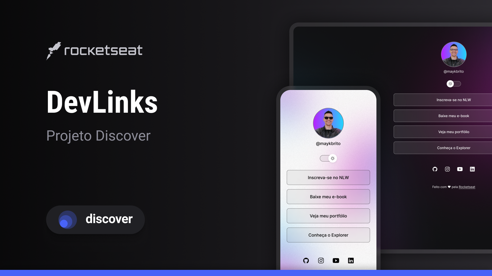

<h1 align="center"> Projeto 01 </h1>

Aulas exclusivas e gratuito, promovido pela Rocketseat para ensino de tecnologias WEB.

  <a href="#-tecnologias">Tecnologias</a>&nbsp;&nbsp;&nbsp;|&nbsp;&nbsp;&nbsp;
  <a href="#-projeto">Projeto</a>&nbsp;&nbsp;&nbsp;|&nbsp;&nbsp;&nbsp;
  <a href="#-layout">Layout</a>&nbsp;&nbsp;&nbsp;|&nbsp;&nbsp;&nbsp;
  <a href="#memo-licença">Licença</a>

  

 

  

## 🚀 Tecnologias

Esse projeto foi desenvolvido com as seguintes tecnologias:

- HTML e CSS
- JavaScript
- Git e Github

## 💻 Projeto

Um site desenvolvido pela equipe rocketseat, Fazendo na pratica o site junto com o desenvolvedor.

## 🔖 Layout

Pode visualizar o projeto por [ESSE-LINK]
(https://www.figma.com/design/zuA2UCPoEubY54jWlIyqBD/DevLinks-%E2%80%A2-Projeto-Discover-(Community)?node-id=1437-191&t=9LtjItlyjVPygj3z-0)
